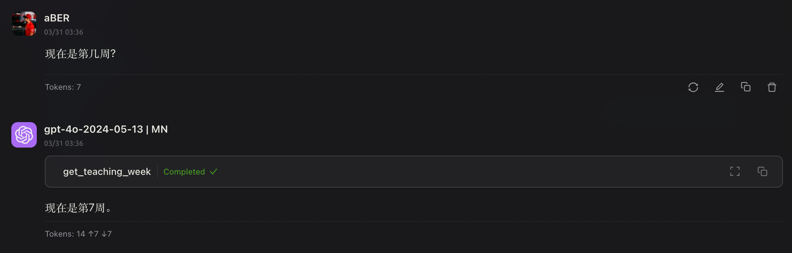
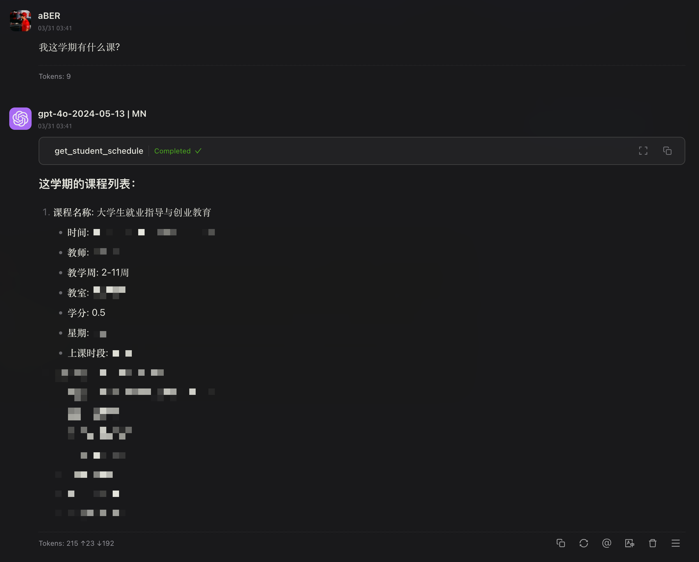
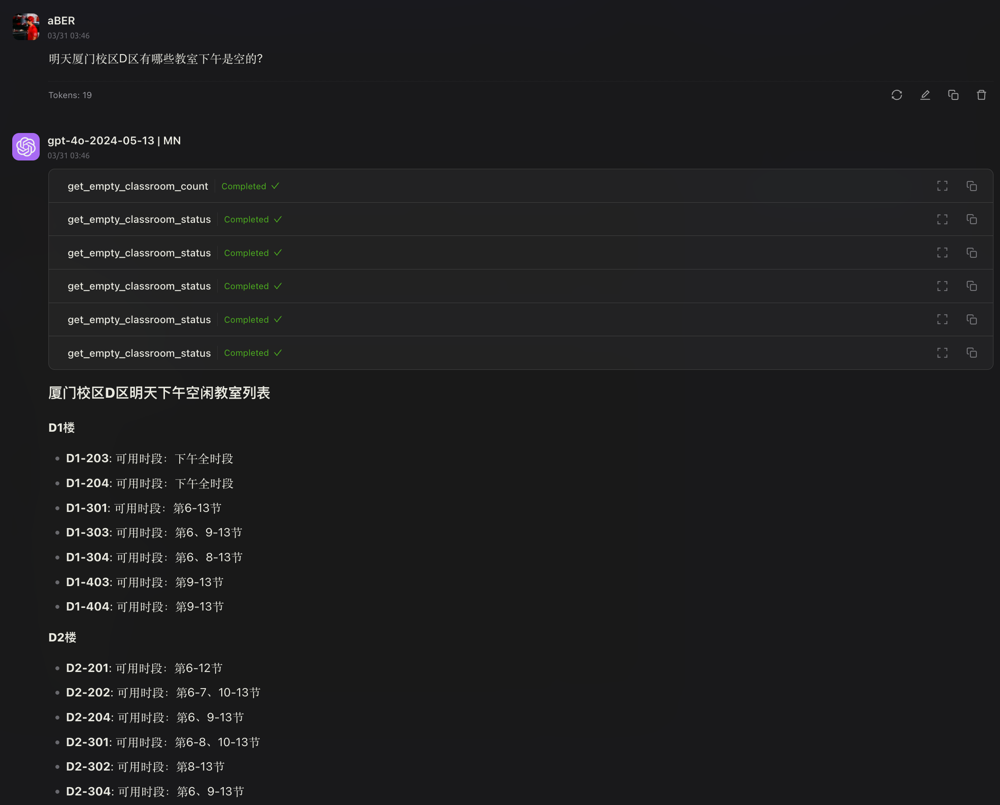
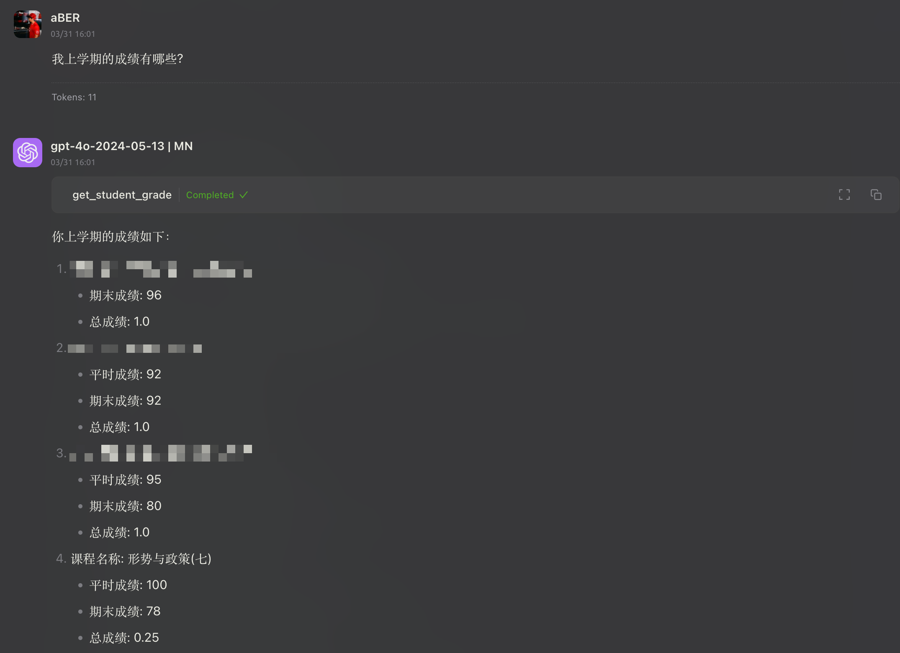
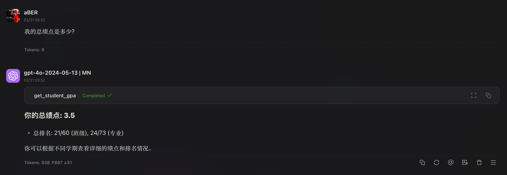
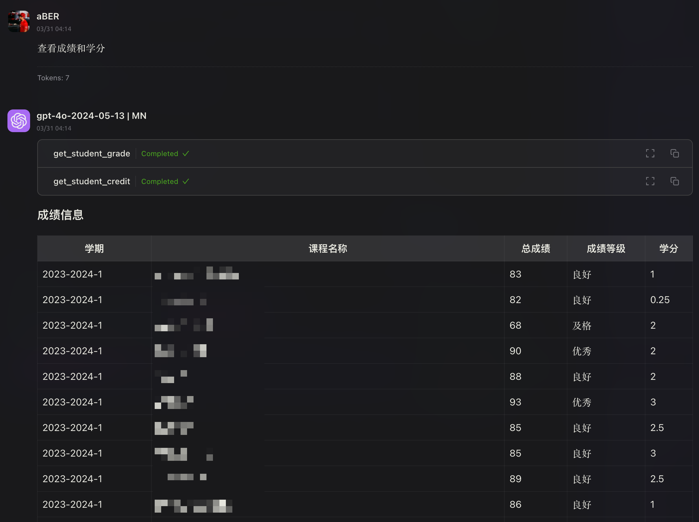
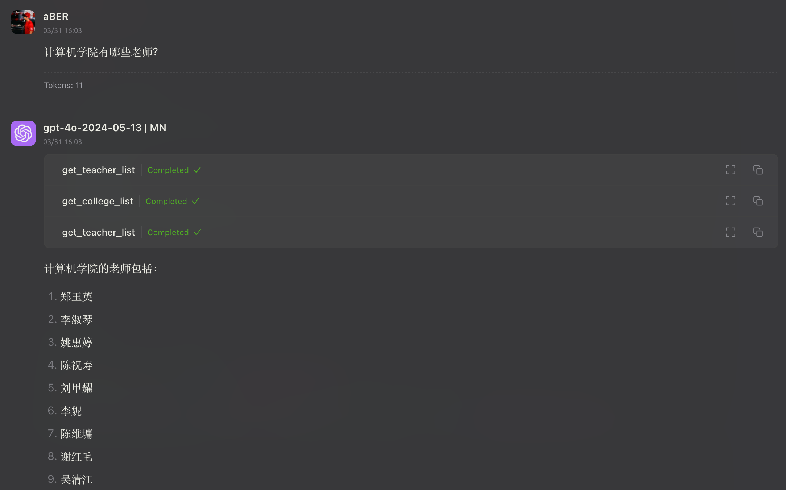
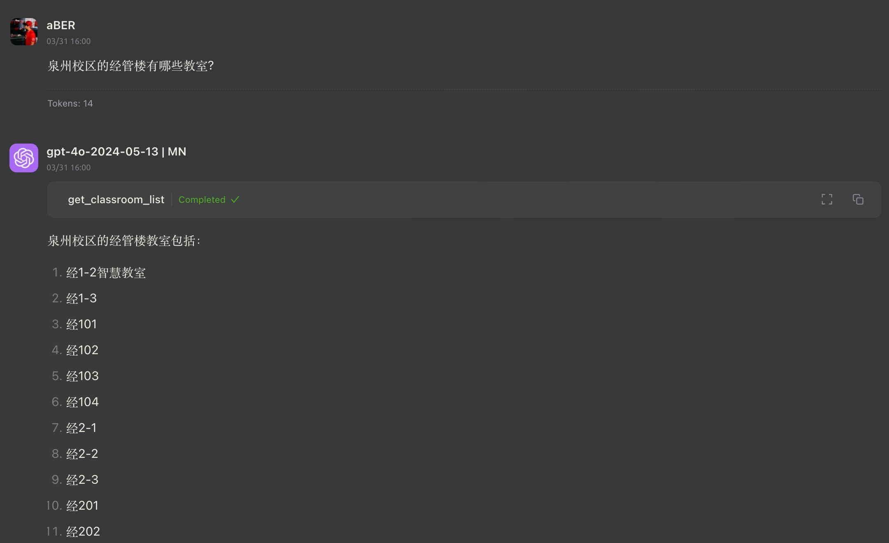

# hqu-school-mcp

[En](README_en.md) | Zh

帮助HQU学生查询课程表、成绩、GPA等教务信息。

## 项目结构

```
src/
└── hqu_school_mcp/
    ├── __init__.py     # 包初始化
    ├── server.py       # MCP 服务器
    ├── sends.py        # Sends API
    └── school.py       # 学校教务系统
```

## 功能

该服务器实现了几个访问学生数据的工具：

- `health_check`：验证服务是否正常运行
- `get_student_schedule`：获取学生课程表
  - 可选"semester"参数（例如："2023-2024-2"）
- ~~`get_student_credit`：获取学生学分信息~~
- ~~`get_student_gpa`：获取学生GPA信息~~
- `get_student_grade`：获取学生成绩信息
  - 可选"school_year"参数（例如："2024-2025"）
  - 可选"semester"参数（"一"代表上学期，"二"代表下学期）
- `get_teaching_week`：从华侨大学教务网站获取当前教学周
- `get_empty_classroom_count`：获取空教室统计信息
  - 可选"campus"参数（"0001"：泉州校区，"0002"：厦门校区，"0003"：龙舟池校区）
- `get_empty_classroom_status`：获取教室详细的使用状态
  - 必选"build_id"参数，例如"0002011"代表C4楼
  - 可选"day"参数，格式为"yyyy-MM-dd"
  - 可选"campus"参数（默认厦门校区）
- `get_college_list`：获取学院列表
- `get_teacher_list`：获取教师列表
  - 必选"college_id"参数，代表学院ID
- `get_course_list`：获取课程列表
- `get_course_timetable`：获取课程课表信息
  - 必选"course_name"参数，代表课程名称
  - 可选"school_year"参数（例如："2024-2025"）
  - 可选"semester"参数（"一"代表上学期，"二"代表下学期）
- `get_class_timetable`：获取班级课表信息
  - 必选"class_id"参数，代表班级ID
  - 可选"school_year"参数（例如："2024-2025"）
  - 可选"semester"参数（"一"代表上学期，"二"代表下学期）
  - 可选"is_overseas"参数，表示是否是境外生班级（默认为false）
- `get_rooms_timetable`：获取教室课表信息
  - 必选"campus"参数，代表校区（例如："厦门校区"）
  - 必选"build_name"参数，代表建筑名称（需从get_building_list获取）
  - 必选"room_id"参数，代表教室ID（需从get_classroom_list获取）
  - 可选"school_year"参数（例如："2024-2025"）
  - 可选"semester"参数（"一"代表上学期，"二"代表下学期）
- `get_building_list`：获取建筑列表
  - 必选"campus"参数，代表校区（例如："厦门校区"、"泉州校区"、"龙舟池校区"）
- `get_classroom_list`：获取教室列表
  - 必选"campus"参数，代表校区（例如："厦门校区"）
  - 必选"build"参数，代表建筑名称

## 快速开始

1. 克隆仓库
```shell
git clone https://github.com/aBER0724/hqu-school-mcp.git
cd hqu-school-mcp
```

2. 使用uv设置环境
```shell
# 创建并激活虚拟环境
uv venv .venv
source .venv/bin/activate  # Linux/macOS
# 或
.venv\Scripts\activate  # Windows

# 安装项目
uv pip install -e .

uv pip install "mcp[cli]"
```

3. 创建并配置环境变量
```shell
cp .env.example .env
```

1. 在`.env`文件中填入 `学号`, 微信`OpenId` 和 [Sends令牌](https://stuinfo-plus.sends.cc/#/setting)
   > 微信`OpenId` 自行搜索如何获取
   
```
# Sends API Token Configuration
SENDS_API_TOKEN=your_sends_api_token

# OpenID Configuration
OPENID=your_openid

# Student ID Configuration
STUDENT_ID=your_student_id
```

### 添加MCP服务器配置

将以下配置添加到Claude桌面应用的配置文件中:

```json
"mcpServers": {
  "hqu-school-mcp": {
    "command": "uv",
    "args": [
      "--directory",
      "your/path/hqu-school-mcp",
      "run",
      "--with",
      "mcp",
      "mcp",
      "run",
      "src/hqu_school_mcp/server.py"
    ]
  }
}
```

## 使用预览

|工具|预览|
|:---:|:---:|
|`get_teaching_week`||
|`get_student_schedule`||
|`get_empty_classroom_count` <br/> `get_empty_classroom_status`||
|`get_student_grade`||
|~~`get_student_gpa`~~||
|~~`get_student_credit`~~ <br/> `get_student_grade`||
|`get_college_list` <br/> `get_teacher_list`||
|`get_classroom_list` <br/> `get_building_list`||
|**其他**<br/> 查询教室/班级/教师/课程课表 <br/> 查询学院|...|
