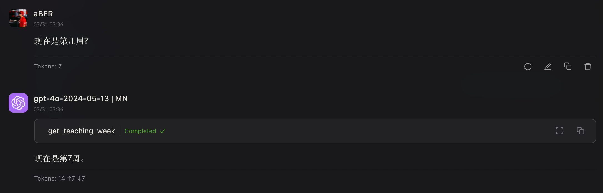

# hqu-school-mcp

En | [Zh](README.md)

Helps HQU students query academic information like schedules, grades, and GPAs.


## Project Structure

```
src/
└── hqu_school_mcp/
    ├── __init__.py     # Package initialization
    ├── server.py       # MCP server implementation
    ├── sends.py        # SENDS API interaction wrapper
    └── school.py       # School academic system related functions
```

## Features

This server implements several tools for accessing student data:

- `health_check`: Verify service status
- `get_student_schedule`: Get class schedule
  - Optional "semester" parameter (e.g. "2023-2024-2")
- `get_student_credit`: Get credit information
- `get_student_gpa`: Get GPA information
- `get_student_grade`: Get grade information
- `get_teaching_week`: Get current teaching week from HQU academic system
- `get_empty_classroom_count`: Get empty classroom statistics
  - Optional "campus" parameter ("0001": Quanzhou Campus, "0002": Xiamen Campus, "0003": Longzhouchi Campus)
- `get_empty_classroom_status`: Get detailed classroom usage status
  - Required "build_id" parameter, e.g. "0002011" represents Building C4
  - Optional "day" parameter (format: "yyyy-MM-dd")
  - Optional "campus" parameter (defaults to Xiamen Campus)

## Quick Start

1. Clone repository
```shell
git clone https://github.com/aBER0724/hqu-school-mcp.git
cd hqu-school-mcp
```

2. Set up environment with uv
```shell
# Create and activate virtual environment
uv venv .venv
source .venv/bin/activate  # Linux/macOS
# or
.venv\Scripts\activate  # Windows

# Install project
uv pip install -e .
```

3. Create and configure environment variables
```shell
cp .env.example .env
```

4. Fill in [Sends Token](https://stuinfo-plus.sends.cc/#/setting) in `.env` file
```
SENDS_API_TOKEN=your_sends_api_token
```

### Add MCP Server Configuration

Add this configuration to Claude desktop app's config file:

```json
"mcpServers": {
  "hqu-school-mcp": {
    "command": "uv",
    "args": [
      "--directory",
      "your/path/hqu-school-mcp",
      "run",
      "--with",
      "mcp",
      "mcp",
      "run",
      "src/hqu_school_mcp/server.py"
    ]
  }
}
```

## Usage Preview

|Tool|Preview|
|---|---|
|`get_teaching_week`||
|`get_student_schedule`||
|`get_empty_classroom_count` <br/> `get_empty_classroom_status`||
|`get_student_credit` <br/> `get_student_grade`||